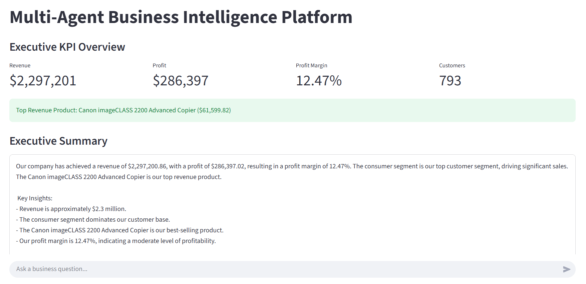
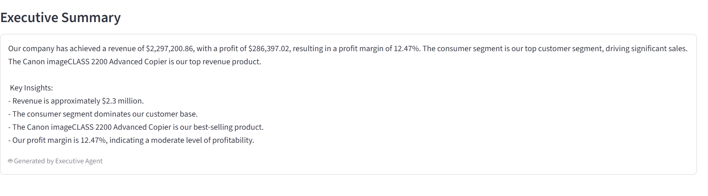
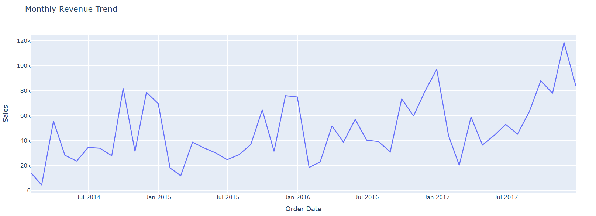
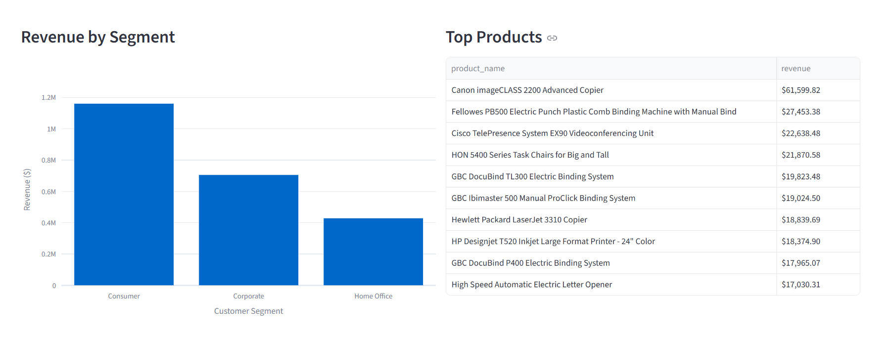
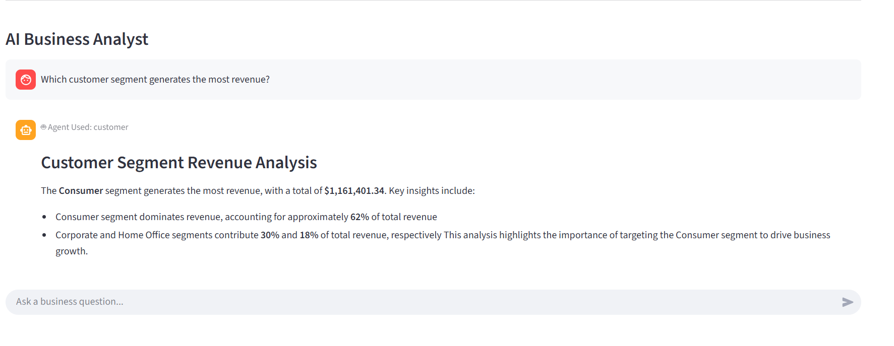

# Multi-Agent Business Intelligence Platform


## Enterprise AI-Powered Analytics & Executive Decision Support System

---

# Overview

The Multi-Agent Business Intelligence Platform is an enterprise-grade analytics solution that combines Data Engineering, Business Intelligence, Retrieval-Augmented Generation (RAG), and Multi-Agent AI Systems into a unified decision-support platform.

The system enables business users and executives to ask natural language questions and receive intelligent, context-aware answers generated by specialized AI agents.

Unlike traditional dashboards that only visualize data, this platform combines structured analytics with AI-powered business reasoning to deliver actionable insights and executive intelligence.

---

# Dashboard Preview

## Executive Dashboard



---

## AI Executive Summary



---

## Monthly Revenue Trend



---

## AI Business Analyst



---

## Agent Routing



---

## Agent Routing


---

# Business Problem

Organizations generate large amounts of business data but often struggle with:

* Fragmented analytics systems
* Inconsistent KPI definitions
* Lack of business context
* Limited executive visibility
* Static dashboards with no reasoning capabilities
* Slow decision-making processes

This platform solves these challenges by integrating:

* Data Warehousing
* Business Intelligence
* AI Agents
* Retrieval-Augmented Generation
* Executive Analytics

into a single intelligent analytics environment.

---

# Key Features

## Enterprise Data Warehouse

* PostgreSQL Data Warehouse
* Star Schema Architecture
* Fact & Dimension Modeling
* Business Analytics Layer
* SQL-Based KPI Computation

---

## Multi-Agent AI System

### Finance Agent

Handles:

* Revenue Analysis
* Profit Analysis
* Profit Margin Calculation
* Financial KPI Monitoring
* Executive Financial Insights

---

### Customer Agent

Handles:

* Customer Segmentation
* Customer Revenue Analysis
* Customer Performance Evaluation
* Segment-Level Analytics

---

### Product Agent

Handles:

* Product Performance Analysis
* Revenue by Product
* Top Product Identification
* Product Intelligence

---

### Executive Agent

Generates:

* Executive Summaries
* Strategic Business Insights
* Executive Reporting
* Decision Support Analytics

---

## LangGraph Orchestration

The platform uses LangGraph to:

* Route user questions
* Select specialized agents
* Coordinate multi-agent workflows
* Generate intelligent responses

---

## Retrieval-Augmented Generation (RAG)

The knowledge base contains:

### Business Rules

* KPI formulas
* Business definitions
* Calculation logic

### KPI Definitions

* Revenue
* Profit
* Profit Margin
* Customer Revenue
* Product Metrics

### Business Glossary

* Business terminology
* Data definitions
* Analytical concepts

Powered by:

* Qdrant Vector Database
* Sentence Transformers
* Semantic Search

---

## AI Business Analyst

Users can ask questions such as:

```text
What is our profit margin?

Which customer segment generates the most revenue?

What are our top products?

Generate an executive summary.

How is profit margin calculated?
```

The platform automatically routes the request to the appropriate AI agent.

---

# System Architecture

```text
                     ┌─────────────────────┐
                     │ Business CSV Files  │
                     └──────────┬──────────┘
                                │
                                ▼
                     ┌─────────────────────┐
                     │    ETL Pipeline     │
                     │ Pandas + Python     │
                     └──────────┬──────────┘
                                │
                                ▼
                     ┌─────────────────────┐
                     │ PostgreSQL Data     │
                     │ Warehouse           │
                     └──────────┬──────────┘
                                │

           ┌────────────────────┼────────────────────┐
           ▼                    ▼                    ▼

  ┌────────────────┐  ┌────────────────┐  ┌────────────────┐
  │ Finance Service│  │Customer Service│  │ Product Service│
  └────────┬───────┘  └────────┬───────┘  └────────┬───────┘
           │                   │                   │
           └──────────┬────────┴────────┬──────────┘
                      ▼                 ▼

              ┌─────────────────────────────┐
              │ LangGraph Supervisor Router │
              └──────────────┬──────────────┘
                             │

       ┌─────────────────────┼─────────────────────┐
       ▼                     ▼                     ▼

 ┌────────────┐      ┌────────────┐      ┌────────────┐
 │ Finance    │      │ Customer   │      │ Product    │
 │ Agent      │      │ Agent      │      │ Agent      │
 └─────┬──────┘      └─────┬──────┘      └─────┬──────┘
       │                   │                   │
       └───────────┬───────┴───────────┬───────┘
                   ▼                   ▼

           ┌─────────────────────────────┐
           │      Executive Agent        │
           └──────────────┬──────────────┘
                          │
                          ▼

           ┌─────────────────────────────┐
           │ Qdrant Vector Database      │
           │ Business Rules              │
           │ KPI Definitions             │
           │ Business Glossary           │
           └──────────────┬──────────────┘
                          │
                          ▼

           ┌─────────────────────────────┐
           │ Groq LLM Business Analyst   │
           └──────────────┬──────────────┘
                          │
                          ▼

           ┌─────────────────────────────┐
           │ Streamlit Dashboard         │
           │ KPI Cards                   │
           │ Executive Summary           │
           │ AI Business Analyst         │
           └─────────────────────────────┘
```

---

# Data Warehouse Architecture

## Fact Table

### sales_fact

Stores:

* Revenue
* Sales
* Profit
* Orders
* Business Metrics

---

## Dimension Tables

### customer_dim

* Customer Details
* Customer Segments

### product_dim

* Product Information
* Product Categories

### region_dim

* Geographic Analytics

### date_dim

* Time Intelligence
* Calendar Analytics

---

# Dashboard Features

## Executive KPI Overview

Displays:

* Revenue
* Profit
* Profit Margin
* Total Customers

---

## AI Executive Summary

Automatically generates:

* Business Overview
* Revenue Insights
* Profitability Analysis
* Strategic Highlights

---

## Revenue Trend Analysis

Interactive visualizations for:

* Monthly Revenue
* Growth Trends
* Business Performance

---

## Customer Analytics

Analyze:

* Customer Segments
* Segment Revenue
* Customer Distribution

---

## Product Analytics

Analyze:

* Top Revenue Products
* Product Performance
* Product Revenue Rankings

---

## AI Business Analyst

Natural language business intelligence powered by:

* LangGraph
* Groq LLM
* RAG Knowledge Base

---

# Example Questions

## Finance

```text
What is our profit margin?
```

## Customer Analytics

```text
Which customer segment generates the most revenue?
```

## Product Analytics

```text
What are our top products?
```

## Executive Intelligence

```text
Generate an executive summary.
```

## Business Rules

```text
How is profit margin calculated?
```

---

# Tech Stack

| Category             | Technology            |
| -------------------- | --------------------- |
| Programming Language | Python                |
| Database             | PostgreSQL            |
| Data Warehouse       | Star Schema           |
| ETL                  | Pandas                |
| Analytics            | SQL                   |
| AI Orchestration     | LangGraph             |
| LLM                  | Groq                  |
| Vector Database      | Qdrant                |
| Embeddings           | Sentence Transformers |
| Dashboard            | Streamlit             |
| Visualization        | Plotly                |
| Deployment           | Docker                |

---

# Project Structure

# Project Structure

```text
MULTI-AGENT-BUSINESS-INTELLIGENCE-PLATFORM
│
├── agents/
│   ├── customer_agent.py
│   ├── executive_agent.py
│   ├── finance_agent.py
│   └── product_agent.py
│
├── analytics/
│   ├── customer_analysis.sql
│   ├── product_analysis.sql
│   └── profitability_analysis.sql
│
├── dashboard/
│   └── streamlit_app.py
│
├── data/
│   ├── raw/
│   └── processed/
│       ├── customer_dim.csv
│       ├── date_dim.csv
│       ├── product_dim.csv
│       ├── region_dim.csv
│       └── sales_fact.csv
│
├── database/
│   ├── connection.py
│   ├── create_tables.py
│   ├── schema.sql
│   ├── data_dictionary.md
│   └── star_schema.md
│
├── docker/
│   └── docker-compose.yml
│
├── docs/
│   └── architecture.md
│
├── etl/
│   ├── extract.py
│   ├── transform.py
│   ├── load.py
│   └── load_dimensions.py
│
├── knowledge_base/
│   ├── business_rules/
│   │   └── business_rules.md
│   │
│   ├── glossary/
│   │   └── business_glossary.md
│   │
│   ├── kpi_definitions/
│   │   └── kpis.md
│   │
│   └── company_docs/
│
├── llm/
│   ├── business_analyst.py
│   └── groq_client.py
│
├── notebooks/
│   └── 01_data_exploration.ipynb
│
├── reports/
│
├── screenshots/
│   ├── dashboard.png
│   ├── executive_summary.png
│   ├── revenue_trend.png
│   ├── monthly_revenue_trend.png
│   ├── ai_analyst.png
│   └── agent_routing.png
│
├── services/
│   ├── analytics_service.py
│   ├── customer_service.py
│   ├── finance_service.py
│   ├── executive_service.py
│   └── product_service.py
│
├── tests/
│   ├── test_analytics_service.py
│   ├── test_customer_service.py
│   ├── test_executive_service.py
│   ├── test_finance_service.py
│   ├── test_product_service.py
│   ├── test_graph.py
│   ├── test_groq.py
│   └── test_langgraph.py
│
├── utils/
│   └── pdf_generator.py
│
├── vector_db/
│   ├── embeddings.py
│   ├── ingest.py
│   ├── ingest_qdrant.py
│   ├── qdrant_client.py
│   ├── qdrant_manager.py
│   ├── rag_pipeline.py
│   ├── retriever.py
│   │
│   └── qdrant_data/
│       ├── collection/
│       ├── meta.json
│       └── .lock
│
├── workflow/
│   ├── chat_interface.py
│   ├── graph.py
│   ├── langgraph_orchestrator.py
│   ├── router.py
│   ├── state.py
│   ├── supervisor.py
│   ├── test_router.py
│   └── test_supervisor.py
│
├── .env
├── .gitignore
├── README.md
├── requirements.txt
├── executive_report.pdf
├── test_connection.py
├── test_db.py
├── check_columns.py
└── debug_product.py
```

---

# Installation

## Clone Repository

```bash
git clone https://github.com/yourusername/Multi-Agent-Business-Intelligence-Platform.git

cd Multi-Agent-Business-Intelligence-Platform
```

---

## Install Dependencies

```bash
pip install -r requirements.txt
```

---

## Configure Environment Variables

Create:

```text
.env
```

Add:

```env
GROQ_API_KEY=your_groq_api_key
```

---

## Start PostgreSQL

```bash
docker compose up -d
```

---

## Load Knowledge Base

```bash
python -m vector_db.ingest_qdrant
```

---

## Launch Dashboard

```bash
streamlit run dashboard/streamlit_app.py
```

---

# Docker Deployment

Build Containers:

```bash
docker compose build
```

Start Platform:

```bash
docker compose up
```

---

# Production Engineering Features

This project demonstrates:

* Data Engineering
* Analytics Engineering
* Data Warehousing
* ETL Development
* Multi-Agent AI Systems
* Retrieval-Augmented Generation
* Semantic Search
* Business Intelligence
* Executive Analytics
* LLM Integration
* Dashboard Development

---

# Future Improvements

## Advanced Analytics

* Revenue Forecasting
* Time-Series Analytics
* Predictive Intelligence

---

## Additional Agents

* Marketing Agent
* Operations Agent
* Supply Chain Agent
* Forecasting Agent

---

## Enterprise Features

* PDF Executive Reports
* Scheduled Reporting
* Email Delivery
* Role-Based Access Control

---

## Cloud Deployment

* AWS
* Azure
* Kubernetes
* CI/CD Pipelines

---

# Why This Project Stands Out

Unlike traditional dashboard projects, this platform combines:

* Data Warehousing
* Business Intelligence
* Multi-Agent AI
* Retrieval-Augmented Generation
* Executive Decision Support

into a single enterprise-grade analytics solution.

The project demonstrates real-world skills across:

* Data Engineering
* Analytics Engineering
* AI Engineering
* Business Intelligence
* LLM Applications
* Multi-Agent Systems

This closely resembles how modern enterprises are integrating AI into analytics and decision-making workflows.
